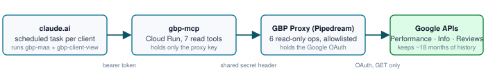

# GBP MAA Skills

Claude skills for the weekly **Google Business Profile** report for local service businesses, using the MAA framework: **Metrics → Analysis → Action**. One skill runs the analysis; the other renders the client-facing page. A read-only MCP server and a Pipedream proxy give the skills live data from Google with no warehouse.

The methodology is Dennis Yu's Local Service Spotlight approach; the skills mirror the `ga4-website-maa` / `ga4-client-view` pair so a client gets one product across channels.

## What's in the box

| Component | What it does |
|---|---|
| **skills/gbp-maa** | The weekly report. Freshness window with the 8-day lag rule, roster screen (duplicates, closed, unverified), seven fixed pulls, primary action by vertical, swing decomposition, 16 hygiene checks, 7 tripwires, QA gate. First-Run (team-gated) and Recurring (owner-facing, guarded) modes; Trial mode for the Maps Visibility Trial verdict. |
| **skills/gbp-client-view** | The final render. Turns a finished MAA into the one-page executive summary (HTML + PDF). Derives, never invents. Shares the renderer with `ga4-client-view`. |
| **mcp/** | `gbp-mcp`: Python FastMCP on Cloud Run, seven read tools, bearer-gated, holds only the proxy key. |
| **proxy/** | The Pipedream workflow that holds the Google OAuth and exposes six read-only, allowlisted operations. |
| **shared/examples/** | The first real run, anonymized: owner report, page-1 spec, rendered one-pager. |
| **docs/meta/** | The building-in-public run record for the build and first run. |

## Getting started

1. Set up the data path once: `shared/frameworks/mcp-setup-guide.md`.
2. Install the skills (plugin marketplace, or copy `skills/*` into `~/.claude/skills/`).
3. In a chat with the GBP connector: `Use the gbp-maa skill on {client}.`
4. Read `WALKTHROUGH.md` for the full loop through review, render, and scheduling.

## Boundaries

- **Read-only.** Nothing here can edit a profile, reply to a review, or post. Every fix is a human action the report asks for.
- **Interactions, not outcomes.** GBP counts taps on Call, Website, and Directions, not answered calls or signed jobs. The reports say so.
- **Agents draft; a human sends.** Every report is a draft until a person reviews it.

## Evidence state (v1.0.0)

`gbp-maa`: Tested (one fresh-chat First-Run, 2026-09-21). `gbp-client-view`: Tested. Neither Scheduled nor Observed yet. Definitive article: GAP. See `CHANGELOG.md`.

## Publishing and registry

Maintainers: `PUBLISHING.md`. Ownership: `CODEOWNERS`. License: MIT.
